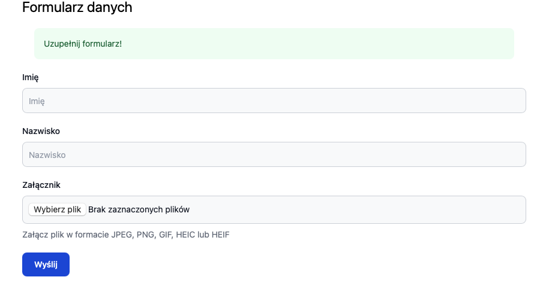
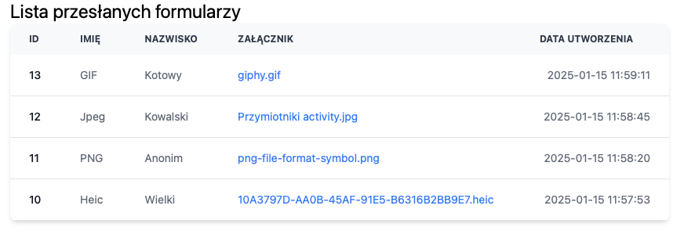

# Instrukcja obsługi aplikacji

## Uruchomienie projektu

### Krok 1: Pobranie kodu z repozytorium

Sklonuj repozytorium:

```bash
git clone https://github.com/bmxmale/simple-form.git
cd simple-form
```

### Krok 2: Uruchomienie projektu przy pomocy DDEV

1. Zainstaluj DDEV zgodnie z [instrukcją instalacji](https://ddev.readthedocs.io/en/stable/#installation).
2. Uruchom DDEV w katalogu projektu:

```bash
ddev start
```

3. Zainstaluj zależności PHP:

```bash
ddev composer install
```

4. Zainstaluj zależności JavaScript:

```bash
ddev yarn install
```

5. Skompiluj style CSS
    
```bash
ddev exec bin/console tailwind:build
```

6. Uruchom migracje bazy danych:

```bash
ddev exec bin/console doctrine:migrations:migrate
```

### Krok 3: Dostęp do aplikacji

Aplikacja będzie dostępna pod adresem: [http://simple-form.ddev.site/](http://simple-form.ddev.site/)

## Dodawanie formularza

1. Przejdź do strony głównej aplikacji.
2. Wypełnij formularz, podając wymagane dane, takie jak imię, nazwisko oraz załącznik.
3. Kliknij przycisk "Wyślij", aby przesłać formularz.



**Wymagania / Ograniczenia formularza**

- Imię: wymagane, maksymalnie 60 znaków.
- Nazwisko: wymagane, maksymalnie 100 znaków.
- Załącznik: wymagany, maksymalny rozmiar 2MB, dozwolone formaty: JPEG, PNG, GIF, HEIC, HEIF.

## Podgląd wysłanych formularzy

1. Przejdź do strony administracyjnej, używając odpowiedniego tokenu administracyjnego w URL, np. `http://simple-form.ddev.site/admin/{token}`.
2. Na stronie administracyjnej zobaczysz listę przesłanych formularzy, zawierającą następujące kolumny:
   - ID
   - Imię
   - Nazwisko
   - Załącznik
   - Data utworzenia
3. Aby pobrać załącznik, kliknij na link w kolumnie "Załącznik" dla wybranego formularza.



**Uwaga:** Token administracyjny znajduje się w pliku `.env` pod kluczem `ADMIN_TOKEN`.
